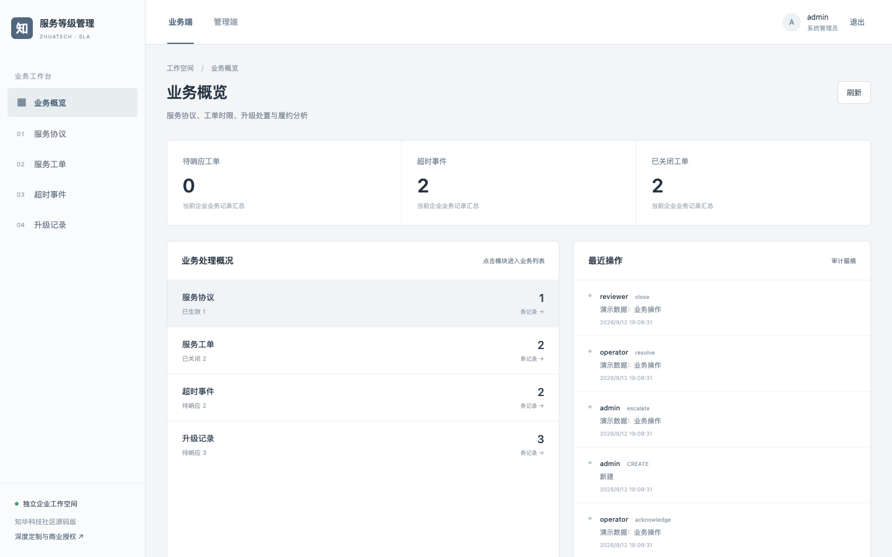
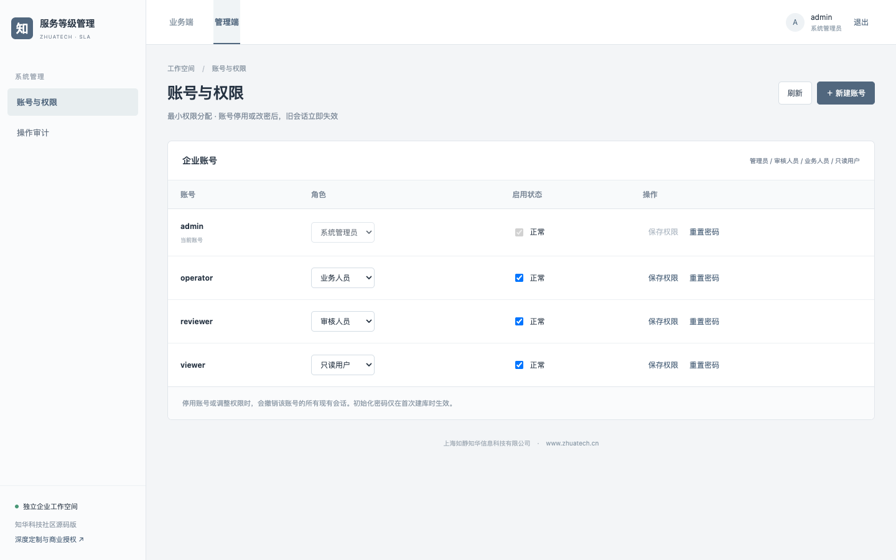
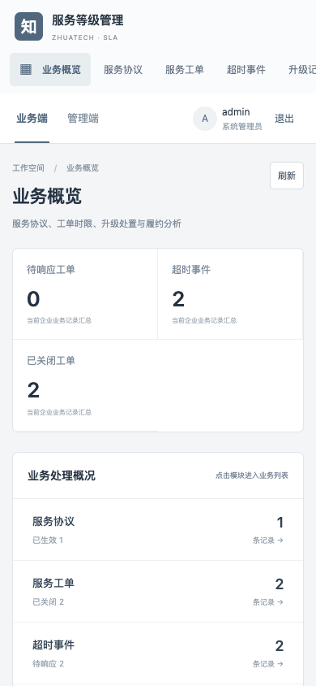

# 服务等级管理系统 | zhuatech-sla

面向企业服务台的知华科技 SLA 项目，由上海如静知华信息科技有限公司维护。它把服务承诺转成可核验的工单时限和超时事件，而不只是一个“工单状态”界面。官网：[www.zhuatech.cn](https://www.zhuatech.cn/)。

## 从协议到履约

```text
服务协议（优先级 / 响应小时 / 解决小时）
  └─ 服务工单（UTC 受理时间）
      ├─ 响应计时 → 响应超时流水
      ├─ 解决计时 → 解决超时流水
      ├─ 自动巡检 / 升级记录
      └─ 解决 → 独立复核关闭 / 重开
```

协议要求响应时限不大于解决时限，已用于工单的协议不能覆盖改价式改写。每分钟巡检未结工单，超时只记录一次；人工响应/解决时也会同步检查，避免漏记。自动和人工升级均生成独立流水。重新打开工单会开启新一轮计时并保留旧审计记录。

## 已交付的页面与接口

业务端有协议、工单、超时事件和升级记录列表，支持搜索、筛选、详情、操作轨迹与 CSV 导出；管理端可管理账号、角色并查看审计。后端提供事务、租户隔离、幂等键、并发版本和附件鉴权。



管理端账号与权限设置：



移动 H5 工作台：



**时间口径：**当前按 UTC 自然小时计算，不含企业专属工作日历、节假日、暂停计时和外部通知渠道。需按正式服务合同调整阈值与计时口径后再投入生产。

## 运行与验证

需要 Docker Compose。复制 `.env.example` 为 `.env`，分别设置 MySQL 与四种角色的独立强密码，然后执行：

```bash
docker compose up -d --build
sh scripts/test.sh
```

业务端与管理端共用 `http://127.0.0.1:8088`（管理入口 `/admin`）；后端健康检查为 `http://127.0.0.1:18080/api/health`。四个初始化账号为 `admin`、`reviewer`、`operator`、`viewer`，密码从环境变量读取。端口可通过 `WEB_PORT`、`API_PORT` 调整。可使用 `.env.demo.example` 做**仅本机**演示，但切勿连接真实业务数据库或向公网开放演示密码。

后端采用 Java 21 / Spring Boot 4 / MySQL 8.4 / Flyway；前端采用 Vue 3 / Vite，适配桌面与 H5。CI 在 MySQL 上运行后端测试；本机脚本默认用 H2 MySQL 兼容模式跑后端验收，再跑前端单测及生产构建。完整验收脚本见 `backend/src/test/resources/acceptance.json`。

## 使用边界与授权

本仓库是可运行的公开源码学习交流版本，**不是 OSI 意义的开源许可**。根据 [LICENSE](LICENSE)，源码仅限个人非商业学习、研究和交流。企业内部生产、客户交付、SaaS、收费服务及其他商用均须先取得上海如静知华信息科技有限公司书面授权。生产上线还需要企业自己的安全评估、备份恢复、合规与业务参数验收。

[知华科技官网](https://www.zhuatech.cn/)提供中小企业信息化、AI 转型、OPC 技术支持、软件项目外包、实施、FDE 外包与深度开发定制咨询。也可扫码添加微信咨询：

| 微信咨询一 | 微信咨询二 |
| --- | --- |
|  |  |

版权及项目维护：上海如静知华信息科技有限公司 · https://www.zhuatech.cn/
